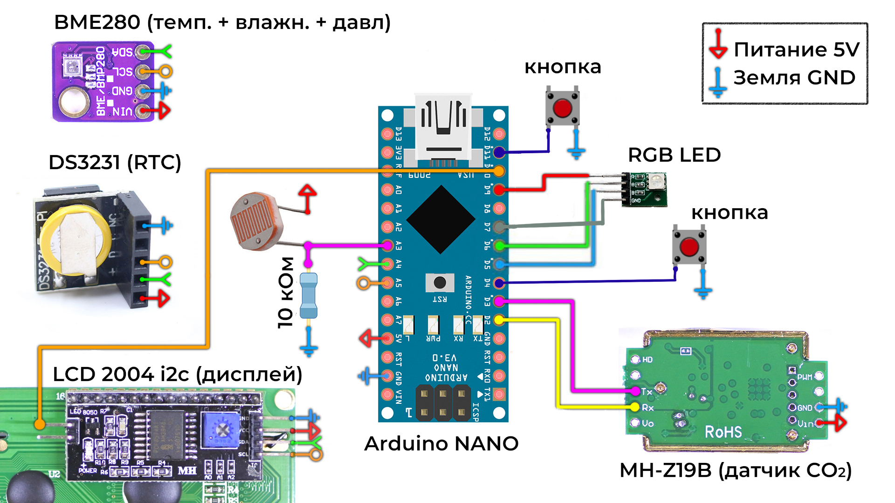

# Пояснительная записка к учебному проекту "СТАНЦИЯ МОНИТОРИНГА МИКРОКЛИМАТА" по курсу "Практикум по цифровому производству"

## Авторы проекта

- Сапунов Филипп ([@Feanor19](https://t.me/Feanor19)) - проектирование корпуса, пайка, сборка устройства
- Меньшиков Тимофей ([@tifomei](https://t.me/tifomei)) - код прошивки и всё с ним связанное

## Причины выбора темы

В комнате в общежитии понадобилось наблюдать примерный уровень углекислого газа и температуру воздуха, чтобы эффективнее проветривать помещение (особенно в холодное время года).

## Первичные требования к проекту

### Измеряемые показатели

1. Температура окружающего воздуха;
2. Влажность окружающего воздуха;
3. Атмосферное давление;
4. Уровень углекислого газа (ppm).

### Отображаемая информация

1. Время и дата (при отключении питания не должны отставать от реального);
2. Температура, влажность, давление, углекислый газ (показания с датчиков в данный момент времени);
3. Графики показаний с перечисленных выше датчиков за сутки.

### Общие требования

1. Изменение яркости дисплея в соответствии с освещённостью вокруг (когда в комнате выключен свет, дисплей не должен ярко гореть);
2. Светодиод, отражающий регистрируемый уровень углекислого газа (зелёный, когда показания в норме, красный и мигающий красный при превышении нормы);
3. Удобный интерфейс, управляемый несколькими механическими кнопками. Множество режимов отображения, лёгкое переключение между ними. Настройка режима яркости дисплея и светодиода, выставление времени.
4. Питание должно быть возможно от обычного блока питания на 5В (как для смартфона), разъём USB Type-C или micro-USB.

## Первичные поставленные задачи

1. Выбор электронных компонентов
2. Прототипирование на макетной плате, проверка компонентов
3. Составление блок-схемы интерфейса
4. Проектирование схемы соединения компонентов
5. Проектирование моделей корпуса
6. Разработка и тестирование прошивки на макетной плате
7. Сборка и проверка работоспособности

## Процесс решения поставленных задач

Здесь кратко описан процесс решения поставленных задач. Некоторые принятые по началу решения изменялись в дальнейшем; здесь всё представлено в хронологической последовательности. Чтобы узнать финальную версию, см. [здесь](#финальная-версия)

### Выбор электроники (первая версия)

В соответствии с заданными требованиями были подобраны следующие компоненты:

1. Arduino Nano;
2. Датчик температуры, влажности, давления BME280;
3. Датчик углекислого газа MH-Z19B;
4. Большой символьный дисплей LCD 2004 I2C;
5. RTC (часы реального времени) DS3231 mini;
6. Механические кнопки;
7. Фоторезистор;
8. RGB LED модуль;
9. Разъём питания USB Type-C.

### Первая версия блок-схемы интерфейса

В соответствии с заданными требованиями была составлена блок-схема интерфейса с использованием двух кнопок.

Обозначения:

- Л1 – одиночное нажатие левой кнопки
- П1 – одиночное нажатие правой кнопки
- Л2 – двойное нажатие левой кнопки
- П2 – двойное нажатие правой кнопки
- УЛ – длительное удержание левой кнопки
- УП – длительное удержание правой кнопки

В основном режиме отображается один показатель увеличено, остальные – в уменьшенном и сокращённом виде. УЛ+УП (одновременное длительное нажатие левой и правой кнопки) из любого экрана переводит в режим настроек, и из любого экрана настроек переводит в основной через окно с подтверждением сохранения изменений.

### Прототипирование на макетной плате и начало разработки прошивки

Для отлаживания прошивки в процессе её разработки требовались все компоненты, подключенные к макетной плате (breadboard), и возможность легко подключать/отключать их к разным пинам ардуино. Кроме того, ещё не была утверждена финальная схема соединения компонентов, т.к. во время разработки прошивки могли выясниться какие-то нюансы, требующие её модификации. По этим причинам уже на этом этапе к кнопкам и датчику CO2 были припаяны половинки джамперов папа-папа, чтобы обеспечить их легкое подключение к макетной плате. Джамперов мама-папа на тот момент в наличии не было, а паяльник был ещё горячий, поэтому половинки джамперов папа-папа были заодно припаяны к пинам дисплея (геометрия пинов не позволяла втыкать их в макетную плату напрямую).

В ходе разработки прошивки выяснилось, что отлавливать раздельно события "УЛ" и "УП" при наличии события "УЛ+УП" неоправданно сложно. Поэтому часть интерфейса, отвечающая за выставление времени в настройках, была изменена: переход между выставлением часов и выставлением минут совершается путём срабатывания "П1", а выставление числа часов/минут совершается путём срабатывания "Л1" (число увеличивается на единицу).

### Первая версия схемы соединения компонентов

Через некоторое время после начала разработки прошивки появилось понимание, как должна выглядеть схема соединения компонентов. По итогу была спроектирована и утверждена следующая схема:

Датчик BME280, RTC и дисплей подключены на общую шину I2C. На схеме не показан порт питания, в него должен вставляться провод от обычного блока питания на 5В (как для смартфонов).

### Проектирование корпуса

Все файлы были сделаны в SOLIDWORKS 2020, расположены [тут](models/).

Были созданы макеты компонентов (названия начинаются с "mock_") для проверки в виртуальной сборке. Для крепления было решено использовать впаиваемые гайки (aka резьбовые втулки) и винты. Для крепления двух половинок корпуса ([передняя](models/case_front.SLDPRT) и [задняя](models/case_back.SLDPRT)) используются потайные М3 винты (чтобы были вровень с поверхностью, закрывать их какой-то нашлепкой не предполагается). Также М3 винтами, вкручиваемыми снаружи, крепятся датчик BME и разъём питания, закрепляясь изнутри обычной гайкой.

В ходе разработки корпуса и продумывания крепления компонентов выяснилось, что выбранный разъём питания USB Type-C не имеет удобных отверстий для крепления, в отличие от разъёма питания micro-USB из личных запасов, который и был в итоге выбран.

Датчику BME требуется доступ к воздуху в комнате, для этих целей на [задней грани](models/case_back.SLDPRT) предусмотрено квадратное отверстие размером чуть больше чувствительной части датчика.

Датчику CO2 тоже требуется доступ к воздуху в комнате, для этого сделана решётка в виде отдельной [детали](models/case_grid.SLDPRT), накрывающая датчик сверху. К задней половине корпуса она крепится потайными М3 винтами, которые вкручиваются в ответные впаиваемые гайки. Сам датчик помещается на сделанную для него "полочку", фиксирующую его положение по двум осям; соединение половин корпуса фиксирует его положение и по третьей оси.

Под фоторезистор отдельное отверстие не предусмотрено, вместо этого оставлена достаточно широкая щель по краям дисплея, с обратной стороны которой предполагается закреплять фоторезистор (специальное крепление не предусмотрено).

#### Подгонка размеров

Отверстия под впаиваемые гайки должны были быть нужного размера, чтобы те в них хорошо закреплялись. При этом при 3D-печати размеры могут значительно искажаться. Поэтому были созданы тестовые модельки (их названия начинаются с "test_suite"), в которых были сделаны отверстия под М2 и М3 впаиваемые гайки, а также под потайные винты М3, использующиеся в нескольких местах корпуса. Во второй [тестовой модельке](models/test_suite_potay.SLDPRT) заодно была протестирована печать "крепёжного уха" в том же положении, в котором оно печаталось как часть передней половинки корпуса.

Тестовые модельки печатались из PLA, из него же печатались и финальные модели.

Первая тестовая моделька претерпела несколько итераций печати и сверки, пока не был подобран нужный размер.

### Продолжение разработки прошивки

В ходе продолжения разработки прошивки выяснилось, что требуется немного изменить подключение светодиода. Пин G светодиода был подключен в пин ардуино D7, не поддерживающий ШИМ. Из-за этого когда светодиод светился зеленым, его яркостью нельзя было управлять (это было упущено по началу, т.к. проверка изменения яркости проводилась при свечении красным). Модификацию схемы подключения см. [здесь](#финальная-версия)

### Сборка

К моменту, когда было пора паять схему, пришла идея вместо этого собрать все на джамперах, получив таким образом полностью разборную конструкцию, позволяющую легко заменить любой компонент, даже без перепаивания. Для этих целей из найденных в личных запасах "ног" были спаяны 4 шины: земля, питание и две шины для I2C.

Первая собранная и уложенная в корпус схема выглядела так:

И она, конечно, не заработала. Только часть компонентов были надежно прикреплены к корпусу (дисплей, RGB LED, датчик BME, датчик CO2), остальные (ардуино, RTC, все четыре шины...) свободно перемещались внутри, вызывая отсоединение одних контактов и появление незапланированных других.

После этого схема была целиком разобрана и собрана заново:

На этот раз все провода прикреплялись к стенкам двусторонним скотчем, все соединения прозванивались. Выяснилось, что левая кнопка работала только при определенном положении припаянных к ней проводов, поэтому они тоже были надёжно зафиксированы c помощью подручных средств. Стоит заметить, что обильное использование двустороннего скотча не нарушает разборность конструкции и не мешает при надобности заменять отдельные компоненты, т.к. он снимается без следа.

### Проблемы и их решения после сборки

Казалось бы, станция была собрана и полностью работала, откуда взяться проблемам?

**Проблема №1**:

Один из авторов захотел попробовать запитать станцию от умного блока питания, способного выдавать различные мощности в зависимости от типа подключенного устройства. После этого эксперимента ардуино не работало при питании через внешний порт; вероятно, сгорел стабилизатор питания на входе 5V.

**Решение:**

Была получена новая ардуино и, благодаря разборности схемы, легко и без пайки подключена вместо старой.

**Проблема №2**:

Через некоторое время после использования станции отвалилось гнездо на плате питания.

**Решение:**

К новой такой же плате были припаяны ноги, плата была подключена вместо старой. Разборность схемы снова немного упростила замену сломанных компонентов.

## Финальная версия

### Компоненты

1. Arduino Nano;
2. Датчик температуры, влажности, давления BME280;
3. Датчик углекислого газа MH-Z19B;
4. Большой символьный дисплей LCD 2004 I2C;
5. RTC (часы реального времени) DS3231 mini;
6. Две механические кнопки;
7. Фоторезистор и резистор 10кОм;
8. RGB LED модуль;
9. Разъём питания micro-USB.

_Изменения по сравнению с первой версией:_

Изменён разъём питания из-за отсутствия возможности крепежа первого.

### Схема соединения компонентов

_Изменения по сравнению с первой версией:_

Изменено подключение пинов светодиодного модуля.

### Блок-схема интерфейса

_Изменения по сравнению с первой версией:_

Изменена только вторая часть интерфейса: убраны события "УЛ" и "УП", которые использовались только в выставлении времени.

### Модели для 3D-печати

Все модели расположены в директории [models](/models).
